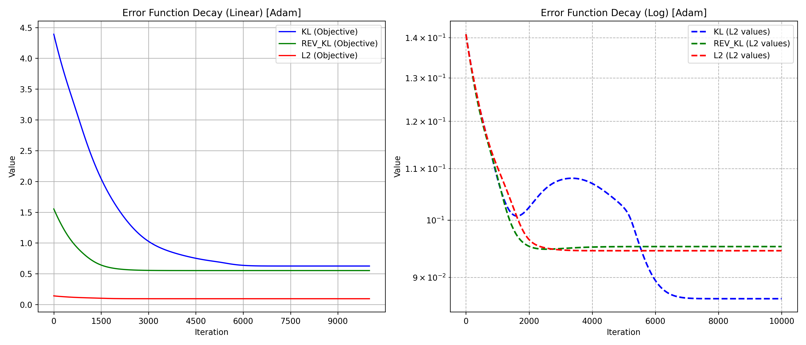

# Gradient Descent Optimization (Loss Performance Comparison)

## Description
Comparison between performance of different loss functions (KL divergence, L1, L2) for gradient descent optimization in arbitrary dimensions

The goal is to optimize the parameters (means, variances, and weights) of a Gaussian mixture (the model) using various gradient descent methods, so as to best fit a user-defined target Gaussian mixture. Additionally, it generates visualizations and animations to illustrate the optimization process and parameter evolution.

**Example:** 
Approximate a target using a mixture of 4 gaussians (only means are being optimized)



## Features

- **Flexible Optimization**: Optimize means, variances, and/or weights of the mixture.
- **Multiple Optimization Methods**: Supports standard gradient descent, alternating gradient descent, Adam optimizer, and stage-wise optimization.
- **Visualizations**: Generates final distribution plots, error decay graphs, and animations of parameter evolution.
- **Customizable Settings**: Configure learning rates, tolerance, and maximum iterations.
- **Result Logging**: Saves initial and final parameters along with optimization history in JSON files.

### Optimization Options

During execution, you will be prompted to select various options:

1. **Select Parameters to Optimize**

    - **Means**: Optimize means? (`yes`/`no`)
    - **Variances**: Optimize variances? (`yes`/`no`)
    - **Weights**: Optimize weights? (`yes`/`no`)

2. **Select Optimization Method**

    - `1. Standard Gradient Descent`
    - `2. Alternating Gradient Descent`
    - `3. Adam Optimizer`
    - `4. Stage-wise Optimization`

    Enter the number corresponding to your choice.

    - If **Stage-wise Optimization** is selected, choose the method for each stage (`1` for standard or `2` for Adam).

3. **Set Learning Rate**

    - Depending on the chosen method, input one or multiple learning rates as prompted.

### Output

All results are saved in the `Results` directory, organized by parameters and optimization methods. Generated files include:

- **Plots**:
  - `FinalDistr_*.png`: Final distribution of the optimized mixture.
  - `Obj_*.png`: Error decay during optimization.
- **Animations**:
  - `Evol_*.gif`: Evolution of the distribution.
  - `Error_*.gif`: Error evolution over iterations.
- **JSON Files**:
  - `InitialValues.json`: Initial parameters and optimization settings.

## Repository Structure

```
gaussian-mixture-optimization/
├── run_optimization.py
├── gauss_mix_optimization.py
├── plotting_functions.py
├── README.md
└── Results/
```

- **run_optimization.py**: Main script to run the optimization process.
- **gauss_mix_optimization.py**: Contains functions for Gaussian mixture optimization.
- **plotting_functions.py**: Contains functions for generating visualizations and animations.
- **Results/**: Directory where all optimization results are saved.
